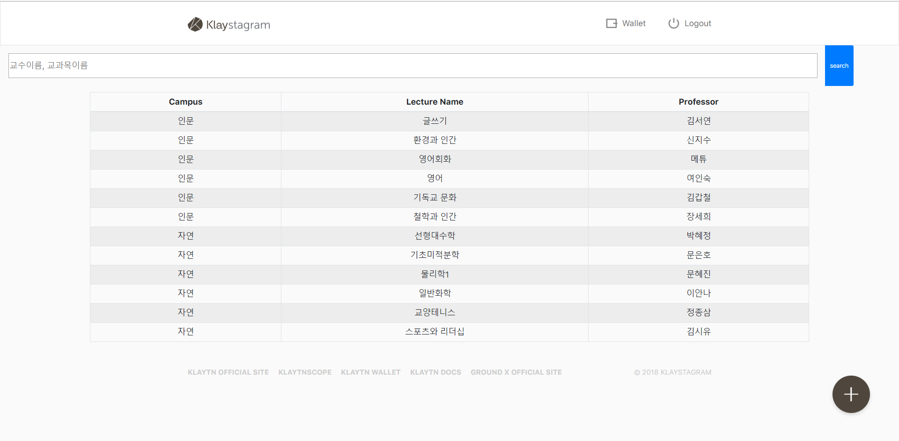

# Klaytn study 5회

모임 장소: 명지대학교 S1353 강의실

모임 일자: 9월 9일 월요일 오후 3시~4시

현재 진행중인 작업: BApp 개발

## BApp 개발 진행상황(활동내역)

|  역할  |  이름  |                           진행상황                           |                          해야할 것                           |
| :----: | :----: | :----------------------------------------------------------: | :----------------------------------------------------------: |
| 백엔드 | 이성희 | 유저 추가, 찾기, 강의 목록 가져오기, 평가 추가하기, 평가목록 가져오기, 결제, 프론트가 알아볼 수 있도록 함수 목록 리드미에 작성하기 | 로그인 회원가입시 유저 추가+찾기 기능 추가, 함수 잘 작동하는지 테스트(프론트가 완료했을 때 테스트 시행) |
| 백엔드 | 최은지 | 좋아요/싫어요 가져오기 및 저장, 클레이 결제하기, 클레이 보상받기 | 함수목록 리드미에 작성하기, 함수 잘 작동하는지 테스트(프론트가 완료했을 때 테스트 시행) |
| 프론트 | 배수혜 | 회원가입 시 이메일 인증코드로 인증하기, 페이지 상단에 서치바 구현, | 인증이 되는지 테스트 시행, 서치바에 과목명/교수명 입력 시 해당 항목 타래로 뜨게 하기, 리덕스 부분 완성, css부분 좀 더 다듬기 |
| 프론트 | 정지우 |      강좌/교수 데이터 불러와서 메인 화면 리스트 띄우기       |                 강좌 상세 화면 구현 완료하기                 |
| 프론트 | 최리안 | 강의평가 추가 모달창, 에러처리, 캠퍼스/대학/전공 데이터 연결 |              리덕스 부분 완성(action, reducer)               |

## 구현사항

로그인 화면

회원가입 화면

강의 등록 화면(+ 버튼 클릭시 나타나는 화면)

강의 검색(상단)/목록 화면(하단)

 

