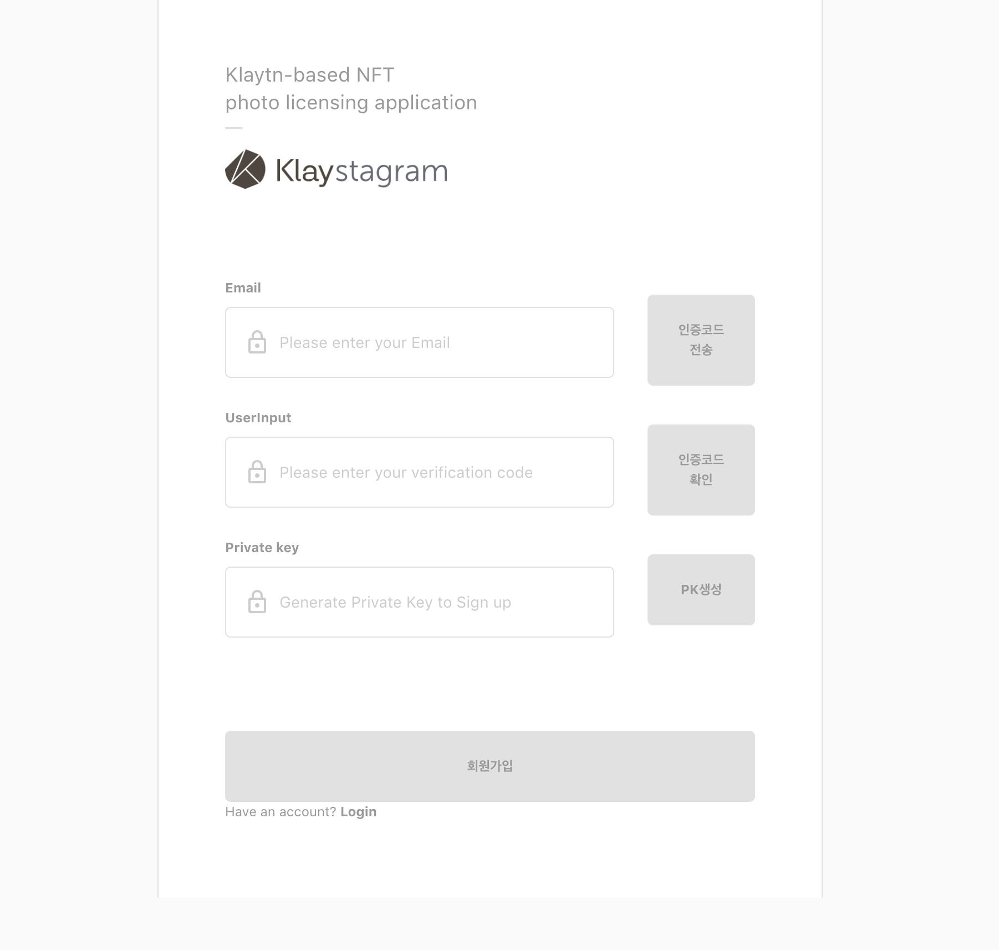
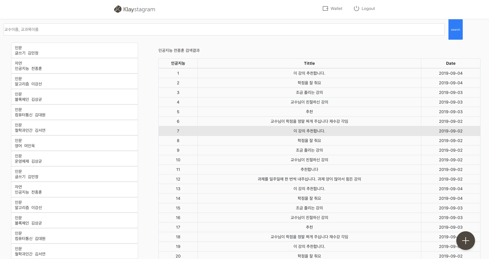

# Klaytn study 6회

### 모임

---

모임 장소: 명지대학교 S1353 강의실

모임 일자: 9월 17일 월요일 오후 4시 30분~5시 30분

현재 진행중인 작업: BApp 개발

### 활동 내용( 개발 진행 상황 )

---

|   역할    |  이름  |                 진행상황                 |                          해야할 것                           |
| :-------: | :----: | :--------------------------------------: | :----------------------------------------------------------: |
| back-end  | 이성희 |   솔리디티 코드 작성 reducer 작성   |                            로그인                            |
| back-end  | 최은지 |   솔리디티 코드 작성 reducer 작성   |                     front 연결 & 테스트                      |
| front-end | 정지우 |              리스트 뷰 완성              |                          redux 연결                          |
| front-end | 배수혜 | 회원가입 폼 완성 & redux연결 서치바 |                         이메일 인증                          |
| front-end | 최리안 |         평가 상세 페이지 뷰 완성         | 평가 작성 페이지 드롭다운 데이터 문제 강의 상세 페이지와 연결 좋아요 싫어요 - 서버에 데이터 보내기 구현 |

#### 회원가입 폼

#### 리스트 뷰

#### 평가 상세 페이지 뷰

