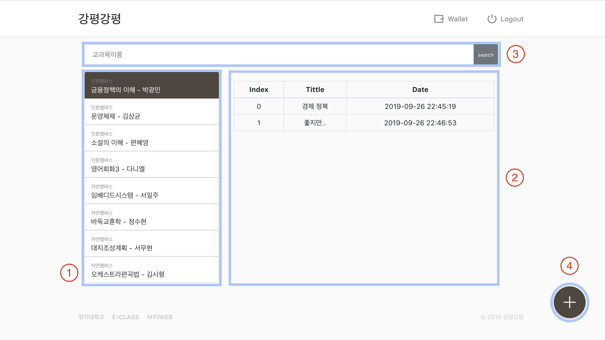

# Klaytn Study 7회 최종보고서

예상보다 시간이 더 걸려서 결국 1주를 더 진행하기로 결정

### 모임

------

모임 장소: 명지대학교 S1353 강의실

모임 일자: 9월 24일 화요일 오후 4시 30분~6시

### 주제

---

강의평가 공유 사이트

### 구현 기능

------

- 회원가입
- 로그인
- 로그아웃
- wallet

- 모든 강의 리스트 가져오기 및 렌더링
- 각 강의리스트에 대한 평가 리스트 가져오기 및 렌더링
- 검색 구현
- 평가 데이터 업로드하기 렌더링 및 클레이튼 제공
- 평가 데이터 디테일 화면 및 열람시 클레이튼 사용
- 디테일 화면에서 좋아요 / 싫어요 평가를 통해 클레이튼 돌려받기

### 페이지의 구조

------

1. 모든 강의 리스트
2. 각 강의 리스트에 대한 평가리스트
3. 검색창 : 강의명을 검색
4. 강의 평가 추가

### 사용자 플로우

---

클레이튼 사용자 : 로그인 > 메인페이지

클레이튼 비사용자 : 회원가입 > generate Key > 로그인 > 메인페이지

검색창 사용 : 검색창 > 강의명 검색 > 평가리스트 렌더링

검색창 미사용 : 강의 리스트에서 강의 선택 > 평가리스트 렌더링

평기리스트 > 평가데이터 선택 > 클레이튼 사용 > 평가 디테일 화면 렌더링 

좋아요 | 싫어요 평가 > 클레이튼 돌려받음 > 닫음 > 메인화면

그냥 닫기 > 메인화면

메인화면 > 평가하기 버튼 클릭 > 평가 페이지 렌더링 > 폼 채우기(강의 검색, 제목, 별점, 내용) > 완료버튼 > 클레이튼 받음

메인화면 > Wallet > 내 키와 클레이튼 확인

메인화면 > 로그아웃 > 로그인 화면

### 시연 영상

---

따로 제출